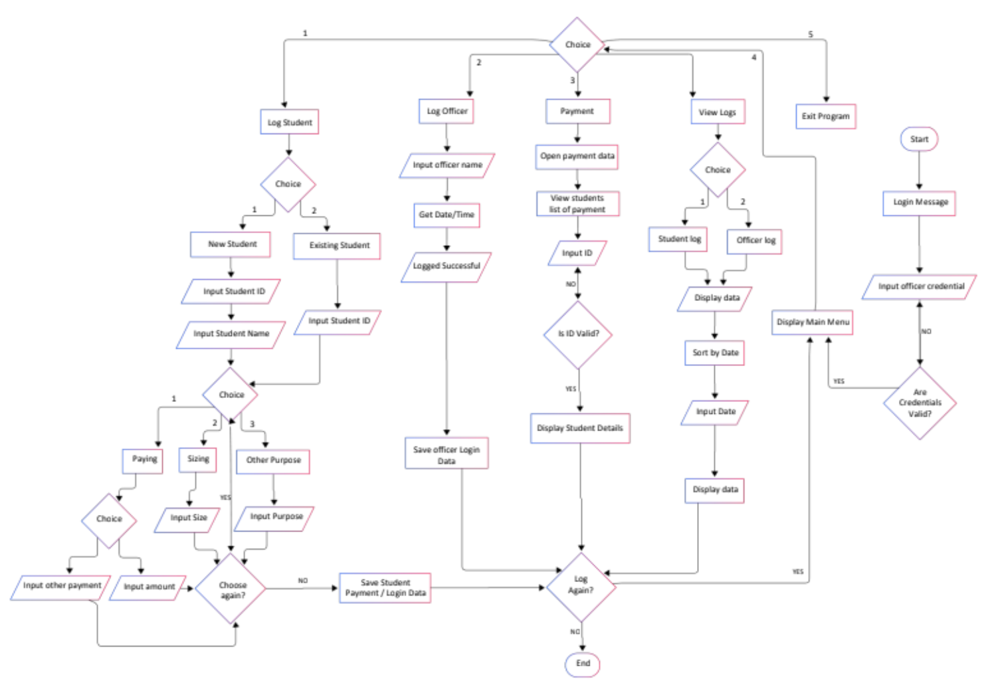

# Payment & Data Management System

A comprehensive management system for tracking students, officers, and payments for the College of Technologies - Student Body Organization.

## Features

- **Secure Authentication**: Role-based access control with secure password handling
- **Student Management**: CRUD operations for student records
- **Officer Management**: Role-based officer management
- **Payment Processing**: Complete payment tracking and management
- **Audit Logging**: Comprehensive logging and audit trail
- **Data Validation**: Input validation and sanitization
- **File-based Storage**: Secure binary file storage with backup capabilities

## Architecture

The system follows a modular architecture with clear separation of concerns:

```
┌─────────────────┐    ┌─────────────────┐    ┌─────────────────┐
│   Presentation  │    │    Business     │    │   Data Access   │
│      Layer      │    │     Layer       │    │      Layer      │
├─────────────────┤    ├─────────────────┤    ├─────────────────┤
│   UI Module     │◄───┤   Auth Module   │◄───┤   File I/O      │
│                 │    │                 │    │   Module        │
├─────────────────┤    ├─────────────────┤    ├─────────────────┤
│   Menu System   │◄───┤  Student Module │◄───┤   Data Format   │
│                 │    │                 │    │   Utilities     │
├─────────────────┤    ├─────────────────┤    ├─────────────────┤
│  Input Handler  │◄───┤ Officer Module  │◄───┤   Validation    │
│                 │    │                 │    │   Utilities     │
└─────────────────┘    ├─────────────────┤    └─────────────────┘
                       │  Payment Module │
                       │                 │
                       ├─────────────────┤
                       │ Logging Module  │
                       │                 │
                       └─────────────────┘
```



## Developers

The following are the developers who contributed to this project:

 | 
--- | ---
Alistair | Miershan

## Modules

### Auth Module
- Secure user authentication with role-based access
- Password hashing and validation
- Session management

### Student Module
- Complete student CRUD operations
- Student search and filtering
- Validation of student data

### Officer Module
- Officer management with access levels
- Role-based permissions
- Officer search and filtering

### Payment Module
- Payment processing and tracking
- Payment validation and status management
- Financial reporting capabilities

### Logging Module
- Comprehensive audit trail
- Action logging with timestamps
- Log filtering and search

### File I/O Module
- Binary file storage for efficiency
- Data integrity checks
- Backup and recovery mechanisms

## Getting Started

### Prerequisites
- GCC or Clang compiler
- Make build system
- C11 standard support

### Building the Project

```bash
# Build the project
make

# Run the project
make run

# Clean build artifacts
make clean
```

### Default Credentials
- Username: `admin`
- Password: `SecurePass123!` (will be created on first run)

## Security Features

- Password hashing using a secure algorithm
- Input validation and sanitization
- Role-based access control
- Session management with timeout
- Audit logging for all actions
- Secure file I/O with integrity checks

## Data Storage

The system stores data in binary format in the `data/` directory:
- `students.dat` - Student records
- `officers.dat` - Officer records
- `payments.dat` - Payment records
- `logs.dat` - Audit logs
- `users.dat` - User accounts

## Backup and Recovery

The system includes automatic backup capabilities:
- Daily, weekly, and monthly backups
- Manual backup option via `make backup`
- Recovery tools in the `tools/` directory

## Error Handling

The system implements comprehensive error handling:
- Standardized error codes
- Detailed error messages
- Proper resource cleanup
- Graceful degradation

## Contributing

1. Fork the repository
2. Create a feature branch
3. Make your changes
4. Add tests if applicable
5. Submit a pull request

## License

This project is licensed under the MIT License - see the LICENSE file for details.

## Support

For support, please contact the College of Technologies - Student Body Organization.